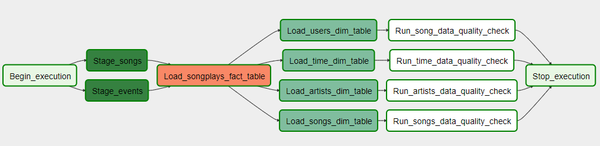

# Data Pipeline Project
---
Sparkify would like to add automation and monitoring to the ETL pipelines. The pipeline should be dynamic and reusable, easily monitored, making easy backfills, and ensure data quality after ETL steps. Our source data resides in a S3 bucket and our destination is a data warehouse in Redshift.
---


## Project Files
---
### sparkify_dag.py
	- The main dag which will run all pipeline tasks
### stage_redshift.py
	- Loads JSON files from S3 to Redshift
### load_fact.py
	- Runs query that loads 'songplays' fact table
### load_dimension.py
	- Runs queries for loading the 'users', 'songs', 'artists', and 'time' dimension tables
### data_quality.py
	- Tests data by checking the number of records. If number of records is zero, throws error
### create_tables.sql
	- SQL script that creates tables for the Redshift data warehouse
### sql_queries.py 
	- SQL queries for the custom operators that load the fact and dimension tables
 
## How To Run Pipeline
1. Configure AWS using AWS CLI command ```aws configure```
	- Enter access key and secret access key as prompted
    - Set region to ```us-west-2```
    - If AWS CLI isn't installed follow the documentation
2. Create Redshift cluster on AWS
	- Place cluster in same region as S3 bucket (in this case: us-west-2)
3. Use ```create_tables.sql``` to create tables in Redshift cluster
4. Run the start shell script for Airflow to access the Airflow UI 
5. Configure connection to Redshift using endpoint of Redshift cluster

6. Turn on the DAG
	- The dag should run automatically since a schedule interval is specified
7. Monitor the pipeline's progress using the Airflow UI
8. Verify that trasformed data passes data null checks
8. Be sure to turn off the DAG and delete the Redshift cluster when done
